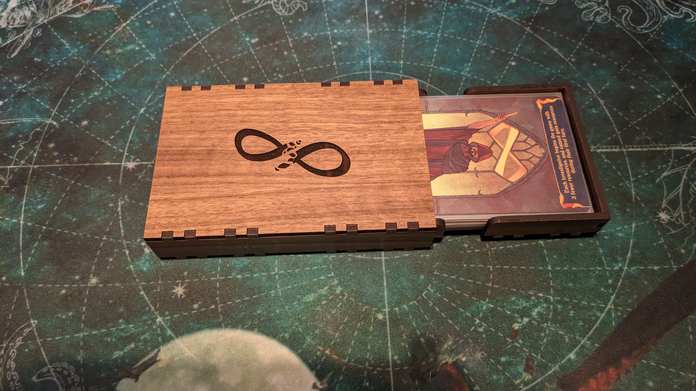
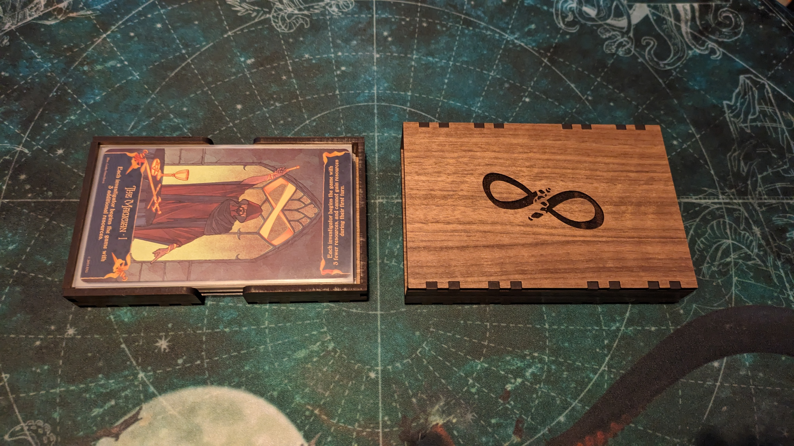
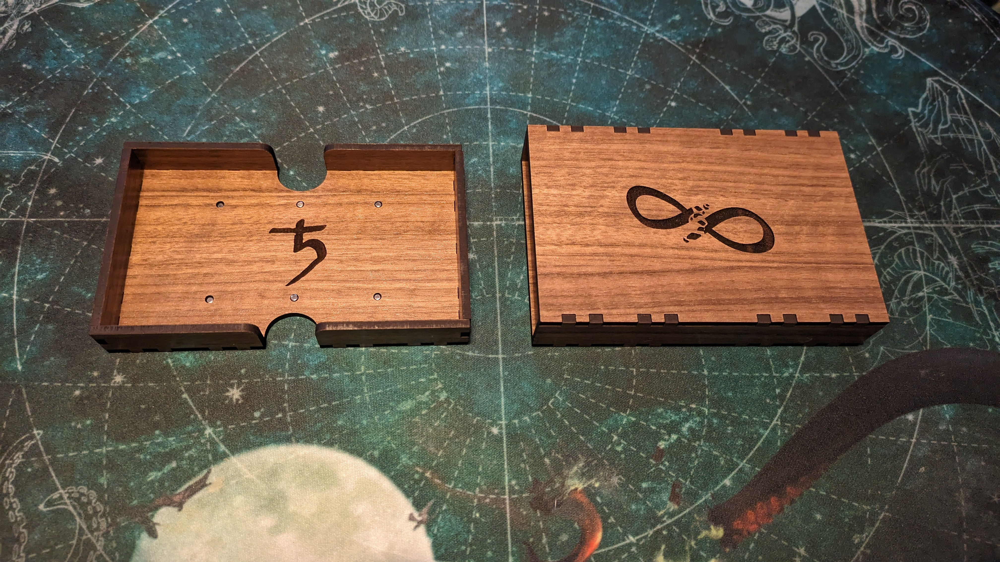

# Arkham Horror LCG: Tarot Box

A box designed for holding the tarot cards that came with The Circle Undone.






The box was made on a laser cutter. Because each laser cutter is different and you may be using different wood, I haven't provided the final files.
Instead I've created a script where you can adjust the different variables to suit what you need.


## The script

### Required installs

[Python 3](https://wiki.python.org/moin/BeginnersGuide/Download)

Download [this repo](https://codeload.github.com/North101/ahlcg_tarot_box/zip/refs/heads/main) and unzip it


### Running

To generate the files with the default arguments:
```bash
python3 -m ahlcg_tarot_box
```

To see all the arguments:
```bash
python3 -m ahlcg_tarot_box --help
```


### Default arguments

```bash
# width of the card (mm)
--width = 123
# height of card (mm)
--height = 73
# depth of the card stack (mm)
--depth = 15
# thickness of the wood (mm)
--thickness = 3.17
# https://community.glowforge.com/t/kerf-explained-hopefully/2917
--kerf = 0.07

# additional card padding (mm)
--padding = 2
# gap between sleeve and tray (mm)
--gap = 0.1
# size of the finger joint tabs (mm)
--tab = 5
# size of finger cutout in the tray (mm)
--finger_cutout = 20

# radius of magnet (mm)
--magnet_r = 1.5
# vertical position of magnet (mm)
--magnet_v = 16.5

# sleeve icon path (must be an svg)
--sleeve_icon = icons/the_circle_undone.svg
# sleeve icon width (mm)
--sleeve_icon_width = 65
# sleeve icon height (mm)
--sleeve_icon_height = 64
# sleeve icon scale
--sleeve_icon_scale = 1.0

# tray icon path (must be an svg)
--tray_icon = icons/inexorable_fate.svg
# tray icon width (mm)
--tray_icon_width = 65
# tray icon height (mm)
--tray_icon_height = 64
# tray icon scale
--tray_icon_scale = 0.5
```


### Arguments you should probably change

#### `width` / `height` / `depth`

The width, height and depth are the sizes of the cards when sleeved in the Sleeve Kings Premium Tarot sleeves. Your sleeves may be different.

For unsleeved use:
```bash
--width 70
--height 120
--depth ?
```


#### `thickness`

The thickness of the wood is important as it affects the size of everything.


#### `kerf`

[Kerf explained](https://community.glowforge.com/t/kerf-explained-hopefully/2917)

The laser has a width and height to it which causes extra material to be removed. `kerf` is the adjustment made to compensate for that. It is also used to configure how tight the finger joints are.

The script will generate a `kerf_test.svg` to help figure out if you have the correct settings. When pushing the pieces together they should be tight.


#### `magnet_r`

The radius of the magnet (half its width).

The script will generate a `kerf_test.svg` to help figure out if you have the correct settings. When pushing the magnet in, it should be a tight fit and you may need to use a hammer to (lightly) tap it in.


## Materials I used

Here are the materials I used. You don't have to use the same ones but if you do you may need to make some adjustments to the arguments

Wood: [Walnut Plywood 12in x 20in (Medium Thickness)](https://shop.glowforge.com/collections/plywood/products/walnut-plywood-finished)

Magnets: [3mm x 3mm (9 needed)](https://www.amazon.co.uk/dp/B0C81JJJ3R)


## Sleeves I used

[Sleeve Kings - 55 x Premium Tarot Card Sleeves (70mm x 120mm) [SKS-9966]](https://sleevekings.com/products/tarot-card-sleeves-70x120mm-55-pack-100-microns-preorder)
* height: 73mm
* width: 123mm
* stack: 12mm
